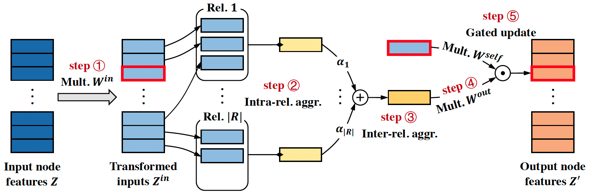

# EurNet: Efficient Multi-Range Relational Modeling of Spatial Multi-Relational Data

This repository provides the PyTorch implementation of the paper [EurNet: Efficient Multi-Range Relational Modeling of Spatial Multi-Relational Data]().
This branch contains complete source code and model weights for the **semantic segmentation** experiments in the paper. 

<p align="center">
   
</p>

EurNet employs the Gated Relational Message Passing (GRMP) layer as its basic component, as graphically shown above.
EurNet can be applied to various domains (e.g., images, protein structures and knowledge graphs) for efficient multi-relational modeling at scale.
Here are the links to other applied domains/tasks of this project:
- [EurNet for Image Classification (TorchDrug implementation)](https://github.com/hirl-team/EurNet-Image/tree/main)
- [EurNet for Image Classification (PyTorch Geometric implementation)](https://github.com/hirl-team/EurNet-Image/tree/pyg-cls)
- [EurNet for Object Detection](https://github.com/hirl-team/EurNet-Image/tree/det)
- EurNet for Protein Structure Modeling (*Working, will release soon*)
- EurNet for Knowledge Graph Reasoning (*Working, will release soon*)

## Roadmap
- [2022/11/xx] The initial release! We release all source code and model weights of EurNet for image classification (both TorchDrug and PyTorch Geometric implementations), object detection and semantic segmentation. 

## TODO
- [ ] Release code and model weights of EurNet for protein structure modeling.
- [ ] Release code and model weights of EurNet for knowledge graph reasoning. 

## Benchmark and Model Zoo

### Pre-training on ImageNet-1K

Following [FocalNet](https://arxiv.org/pdf/2203.11926), we fine-tune the models pre-trained on ImageNet-1K classification.
The pre-trained checkpoints for EurNet-T/S/B can be downloaded with the following links:
- [Pre-trained EurNet-T](https://eurnet.s3.us-east-2.amazonaws.com/checkpoints/td_eurnet_tiny_1k_pretrain.pth)
- [Pre-trained EurNet-S](https://eurnet.s3.us-east-2.amazonaws.com/checkpoints/td_eurnet_small_1k_pretrain.pth)
- [Pre-trained EurNet-B](https://eurnet.s3.us-east-2.amazonaws.com/checkpoints/td_eurnet_base_1k_pretrain.pth)

### Fine-tuning on ADE20K

The experiments are conducted with [UperNet](https://openaccess.thecvf.com/content_ECCV_2018/papers/Tete_Xiao_Unified_Perceptual_Parsing_ECCV_2018_paper.pdf). 
The input resolution is 512x512 and the schedule is 160k iterations.

|    Model   | #Params. (M) | FLOPs (G) | mIoU | mIoU (MS) |                                                        Config                                                         |   Ckpt   |   Log   |
|:------------:|:------------:|:------:|:-------:|:--------:|:----------------------------------------------------------------------------------------------------------------------:|:--------:|:-------:|
|   EurNet-T   | 62 | 948 |  47.2   |  48.4 |    [config](https://github.com/hirl-team/EurNet-Image/blob/seg/segmentation/configs/eurnet/upernet_eurnet_tiny_512x512_160k_ade20k.py)     | [ckpt](https://eurnet.s3.us-east-2.amazonaws.com/checkpoints/eurnet_tiny_upernet_ade20k_160k_last_epoch.pth) | [log](https://eurnet.s3.us-east-2.amazonaws.com/logs/eurnet_tiny_upernet_ade20k_160k.txt) |
|   EurNet-S   | 85 | 1042 |  49.8   |  50.8 |    [config](https://github.com/hirl-team/EurNet-Image/blob/seg/segmentation/configs/eurnet/upernet_eurnet_small_512x512_160k_ade20k.py)     | [ckpt](https://eurnet.s3.us-east-2.amazonaws.com/checkpoints/eurnet_small_upernet_ade20k_160k_last_epoch.pth) | [log](https://eurnet.s3.us-east-2.amazonaws.com/logs/eurnet_small_upernet_ade20k_160k.txt) |
|   EurNet-B   | 126 | 1190 |  50.7   |  51.8     |    [config](https://github.com/hirl-team/EurNet-Image/blob/seg/segmentation/configs/eurnet/upernet_eurnet_base_512x512_160k_ade20k.py)     | [ckpt](https://eurnet.s3.us-east-2.amazonaws.com/checkpoints/eurnet_base_upernet_ade20k_160k_last_epoch.pth) | [log](https://eurnet.s3.us-east-2.amazonaws.com/logs/eurnet_base_upernet_ade20k_160k.txt) |


## Installation

This repository is officially tested with the following environments:
- Linux
- Python 3.6+
- PyTorch 1.10.0
- CUDA 11.3

The environment could be prepared in the following steps:
1. Create a virtual environment with conda:
```
conda create -n eurnet_seg python=3.7.3 -y
conda activate eurnet_seg
```
2. Install PyTorch with the [official instructions](https://pytorch.org/). For example:
```
conda install pytorch==1.10.0 torchvision==0.11.0 torchaudio==0.10.0 cudatoolkit=11.3 -c pytorch -c conda-forge
```
3. Install dependencies:
```
pip install -r requirements.txt
```
4. Install `mmcv` and `mmsegmentation` for object detection:
```
pip install mmcv-full==1.5.0 -f https://download.openmmlab.com/mmcv/dist/cu113/torch1.10.0/index.html
pip install mmsegmentation==2.25.0
```

## Usage

### Prepare Dataset

#### ADE20K

ADE20K dataset is used for semantic segmentation experiments. 
Download train/val splits from this [link](http://data.csail.mit.edu/places/ADEchallenge/ADEChallengeData2016.zip). We recommend 
symlink the dataset folder to `./segmentation/datasets/ade20k/`. The folder structure is expected to be:
```
segmentation/
  datasets/
    ADEChallengeData2016/
      annotations/
        training/
          ADE_train_00000001.png
          ...
        validation/
      images/
        training/
          ADE_train_00000001.jpg
          ...
        validation/
```

## Launch Experiments

We follow `mmsegmentation` to use python based configuration file system. The config could be modified by command line arguments.

To run an experiment:
```
python3 ./segmentation/launch.py -c [config file] --output_dir [output directory] [config options]
```
The config options are in "key=value" format. For example, `optimizer.type=AdamW` modifies the sub key `type` in `optimizer` with value `AdamW`.

A full example of training and evaluating EurNet-T with UperNet on ADE20K for 160k iterations from an ImageNet-1K pre-trained checkpoint:
```
python3 ./segmentation/launch.py -c configs/eurnet/upernet_eurnet_tiny_512x512_160k_ade20k.py \
--output_dir ./experiments/ade20k/upernet/eurnet_tiny/ --pretrained [path of imagenet pretrained model]
```

**Note that**, the root of relative dir is `./segmentation`. All the training configuration files are in `./segmentation/configs/`. 
To reproduce the ADE20K semantic segmentation results, please **follow the corresponding config file** and **remember to load the ImageNet-1K pre-trained checkpoint**. 

## License

This repository is released under the MIT license as in the [LICENSE](LICENSE) file.

## Citation

If you find this repository useful in your research, please cite the following paper:
```
@article{xu2022eurnet,
  title={EurNet: Efficient Multi-Range Relational Modeling of Spatial Multi-Relational Data},
  author={Xu, Minghao and Guo, Yuanfan and Xu, Yi and Tang, Jian and Chen, Xinlei and Tian, Yuandong},
  journal={arXiv preprint arXiv:},
  year={2022}
}
```

## Acknowledgements

The development of this project is guided by the following open-source projects. 
We would like to thank the authors for releasing the source code.
- [FocalNet](https://github.com/microsoft/FocalNet)
- [Swin Transformer Semantic Segmentation](https://github.com/SwinTransformer/Swin-Transformer-Semantic-Segmentation)
- [Swin Transformer](https://github.com/microsoft/Swin-Transformer)
- [ConvNeXt](https://github.com/facebookresearch/ConvNeXt)
- [Vision GNN](https://github.com/huawei-noah/Efficient-AI-Backbones/tree/master/vig_pytorch)
